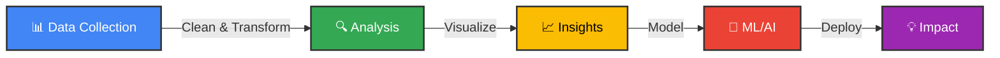
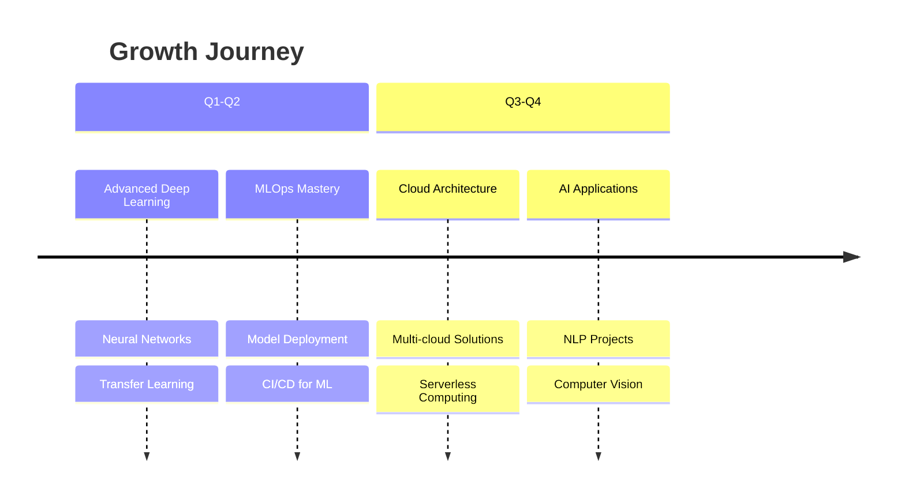

<p align="center">
  <a href ="#"> 
  
  </a>
</p>

<p align="center">
  <a href ="#"> 
  
  </a>
</p>

<p align="center">
  <a href ="#"> 
  
  </a>
</p>

<div align="center">

### ☰ Quick Navigation

[📶 Stats](#-github-stats) • [💻 Skills](#technical-arsenal) • [🗃️ Projects](#-featured-projects) • [📚 Resources](#build-in-public--knowledge-hub) • [📫 Connect](#-lets-connect)

</div>


## ၊၊||၊ GitHub Stats

<p align="center">
  <a href ="#"> 
  
  </a>
</p>

<details>
<summary align="center"><b>⌞ ⌝ Click to Expand Full GitHub Analytics</b></summary>
<br/>

<p align="center">
  <a href ="#"> 
  
  &nbsp;&nbsp;&nbsp;
  
  </a>
</p>

<br/>

<p align="center">
  <a href ="#"> 
  
  </a>
</p>

<br/>

<p align="center">
  <a href ="#"> 
  
  </a>
</p>

<br/>

<p align="center">
  <a href ="#"> 
  
  </a>
</p>

</details>


## ⚙︎ Technical Arsenal

<div align="center">

### *Transforming Data into Intelligence*

```
┌─────────────────────────────────────────────────────────────┐
│  "In Data We Trust, With Analytics We Decide,               │
│   Through AI We Transform"                                  │
└─────────────────────────────────────────────────────────────┘
```


</div>


## ᯓ✈︎ My Data Journey

<div align="center">



</div>


<details>
<summary align="center"><b>⌞ ⌝ Click to Expand My Complete Skill Ecosystem</b></summary>
<br/>

<table>
<tr>
<td colspan="2" align="center" bgcolor="#4285f4">
<h3 style="color:white;">FOUNDATION LAYER: Programming & Scripting</h3>
</td>
</tr>
<tr>
<td width="30%" align="center">

<br/><b>Python</b>
<br/>━━━━━━━━━━ 95%
<br/>⭐⭐⭐⭐⭐
<br/><sub><i>Primary Weapon</i></sub>
</td>
<td width="70%">
<b>Use Cases:</b> Data Analysis • ML Pipelines • Automation • ETL<br/>
<b>Libraries Mastered:</b> Pandas, NumPy, Scikit-learn, TensorFlow<br/>
<b>Strength:</b> Building end-to-end data solutions
</td>
</tr>
<tr>
<td width="30%" align="center">

<br/><b>R</b>
<br/>━━━━━━━━░░ 85%
<br/>⭐⭐⭐⭐
<br/><sub><i>Statistical Powerhouse</i></sub>
</td>
<td width="70%">
<b>Use Cases:</b> Statistical Analysis • Data Visualization • Research<br/>
<b>Packages:</b> ggplot2, dplyr, tidyr, caret<br/>
<b>Strength:</b> Advanced statistical modeling
</td>
</tr>
<tr>
<td width="30%" align="center">

<br/><b>Web Tech</b>
<br/>━━━━━━━░░░ 78%
<br/>⭐⭐⭐⭐
<br/><sub><i>Dashboard Builder</i></sub>
</td>
<td width="70%">
<b>Use Cases:</b> Interactive Dashboards • Reporting • Web Apps<br/>
<b>Frameworks:</b> Streamlit, Dash, Flask<br/>
<b>Strength:</b> Creating user-friendly interfaces
</td>
</tr>
</table>


<table>
<tr>
<td colspan="2" align="center" bgcolor="#34a853">
<h3 style="color:white;">DATA LAYER: Storage & Querying</h3>
</td>
</tr>
<tr>
<td width="30%" align="center">

<br/><b>SQL Expertise</b>
<br/>━━━━━━━━━░ 90%
<br/>⭐⭐⭐⭐⭐
<br/><sub><i>Query Architect</i></sub>
</td>
<td width="70%">
<b>Databases:</b> MySQL, PostgreSQL, SQL Server, SQLite<br/>
<b>Skills:</b> Complex Joins • Window Functions • Query Optimization<br/>
<b>Specialty:</b> Performance tuning & data warehousing
</td>
</tr>
</table>


<table>
<tr>
<td colspan="2" align="center" bgcolor="#fbbc04">
<h3>CLOUD LAYER: Scalable Infrastructure</h3>
</td>
</tr>
<tr>
<td width="30%" align="center">

<br/><b>Azure Ecosystem</b>
<br/>━━━━━━━━━░ 90%
<br/>⭐⭐⭐⭐⭐
<br/><sub><i>Cloud Architect</i></sub>
</td>
<td width="70%">
<b>Services:</b> Data Factory • Synapse • Databricks • Storage<br/>
<b>Skills:</b> Pipeline Development • Data Warehousing • ETL/ELT<br/>
<b>Specialty:</b> Building scalable data platforms
</td>
</tr>
<tr>
<td width="30%" align="center">

<br/><b>Apache Spark</b>
<br/>━━━━━━━━░░ 80%
<br/>⭐⭐⭐⭐
<br/><sub><i>Big Data Engineer</i></sub>
</td>
<td width="70%">
<b>Use Cases:</b> Large-scale Processing • Real-time Analytics<br/>
<b>Skills:</b> PySpark • SparkSQL • MLlib • Streaming<br/>
<b>Specialty:</b> Processing terabytes of data efficiently
</td>
</tr>
</table>


<table>
<tr>
<td colspan="2" align="center" bgcolor="#ea4335">
<h3 style="color:white;">INTELLIGENCE LAYER: ML & AI</h3>
</td>
</tr>
<tr>
<td width="30%" align="center">

<br/><b>ML Toolkit</b>
<br/>━━━━━━━━░░ 85%
<br/>⭐⭐⭐⭐⭐
<br/><sub><i>Model Builder</i></sub>
</td>
<td width="70%">
<b>Libraries:</b> Scikit-learn • TensorFlow • Spark MLlib<br/>
<b>Algorithms:</b> Classification • Regression • Clustering • Neural Networks<br/>
<b>Specialty:</b> End-to-end ML pipeline development
</td>
</tr>
<tr>
<td width="30%" align="center">

<br/><b>DS Libraries</b>
<br/>━━━━━━━━━━ 95%
<br/>⭐⭐⭐⭐⭐
<br/><sub><i>Data Wizard</i></sub>
</td>
<td width="70%">
<b>Stack:</b> NumPy • Pandas • SciPy • Statsmodels<br/>
<b>Skills:</b> Feature Engineering • Statistical Analysis • Time Series<br/>
<b>Specialty:</b> Turning messy data into insights
</td>
</tr>
</table>


<table>
<tr>
<td colspan="2" align="center" bgcolor="#9c27b0">
<h3 style="color:white;">VISUALIZATION LAYER: Storytelling with Data</h3>
</td>
</tr>
<tr>
<td width="30%" align="center">

<br/><b>Power BI</b>
<br/>━━━━━━━━━░ 90%
<br/>⭐⭐⭐⭐⭐
<br/><sub><i>Business Intelligence</i></sub>
</td>
<td width="70%">
<b>Expertise:</b> Interactive Dashboards • DAX • M Query • Reports<br/>
<b>Skills:</b> Data Modeling • KPI Design • Automated Reporting<br/>
<b>Impact:</b> Empowering stakeholders with self-service analytics
</td>
</tr>
<tr>
<td width="30%" align="center">

<br/><b>Visualization</b>
<br/>━━━━━━━━░░ 88%
<br/>⭐⭐⭐⭐⭐
<br/><sub><i>Chart Master</i></sub>
</td>
<td width="70%">
<b>Tools:</b> Matplotlib • Seaborn • Plotly • Bokeh<br/>
<b>Skills:</b> Custom Charts • Interactive Plots • 3D Visualization<br/>
<b>Specialty:</b> Creating publication-ready visualizations
</td>
</tr>
<tr>
<td width="30%" align="center">

<br/><b>Streamlit & Dash</b>
<br/>━━━━━━━━░░ 87%
<br/>⭐⭐⭐⭐⭐
<br/><sub><i>App Developer</i></sub>
</td>
<td width="70%">
<b>Use Cases:</b> ML Demos • Data Apps • Interactive Tools<br/>
<b>Skills:</b> Rapid Prototyping • User Interface • Real-time Updates<br/>
<b>Impact:</b> Making ML models accessible to everyone
</td>
</tr>
</table>


<table>
<tr>
<td colspan="2" align="center" bgcolor="#0f9d58">
<h3 style="color:white;">DEVELOPMENT LAYER: Tools & Environment</h3>
</td>
</tr>
<tr>
<td width="30%" align="center">

<br/><b>Dev Environments</b>
<br/>━━━━━━━━━░ 93%
<br/>⭐⭐⭐⭐⭐
<br/><sub><i>Code Commander</i></sub>
</td>
<td width="70%">
<b>Tools:</b> VS Code • Jupyter • PyCharm • RStudio • Anaconda<br/>
<b>Skills:</b> Efficient Coding • Debugging • Extensions • Shortcuts<br/>
<b>Productivity:</b> Lightning-fast development workflow
</td>
</tr>
<tr>
<td width="30%" align="center">

<br/><b>Version Control</b>
<br/>━━━━━━━━━░ 90%
<br/>⭐⭐⭐⭐⭐
<br/><sub><i>Collaboration Pro</i></sub>
</td>
<td width="70%">
<b>Stack:</b> Git • GitHub • Jenkins • CI/CD Pipelines<br/>
<b>Skills:</b> Branching • Merging • Code Reviews • Automation<br/>
<b>Practice:</b> Clean commits, collaborative development
</td>
</tr>
<tr>
<td width="30%" align="center">

<br/><b>Systems</b>
<br/>━━━━━━━━░░ 88%
<br/>⭐⭐⭐⭐⭐
<br/><sub><i>System Navigator</i></sub>
</td>
<td width="70%">
<b>Platforms:</b> Windows • Linux (Ubuntu) • Cloud Environments<br/>
<b>Skills:</b> Shell Scripting • Remote Access • System Admin<br/>
<b>Tools:</b> PuTTY • WinSCP • Terminal
</td>
</tr>
</table>


<table>
<tr>
<td colspan="2" align="center" bgcolor="#0052cc">
<h3 style="color:white;">COLLABORATION LAYER: Teamwork & Management</h3>
</td>
</tr>
<tr>
<td width="30%" align="center">

<br/><b>Agile & PM</b>
<br/>━━━━━━━━░░ 88%
<br/>⭐⭐⭐⭐⭐
<br/><sub><i>Project Organizer</i></sub>
</td>
<td width="70%">
<b>Methodology:</b> Agile • Scrum • Kanban<br/>
<b>Skills:</b> Sprint Planning • Task Management • Team Coordination<br/>
<b>Impact:</b> Delivering projects on time, every time
</td>
</tr>
</table>

</details>


## 모 My Specialization Matrix

<div align="center">

```
         DATA ENGINEERING        DATA SCIENCE         ML/AI DEPLOYMENT
              ████████                ██████              ████████
               88%                     85%                  82%
                │                       │                    │
                └───────────┬───────────┴────────────────────┘
                            │
                    ┌───────▼───────┐
                    │  FULL-STACK   │
                    │ DATA ANALYST  │
                    └───────────────┘
```

</div>


## ⛐ What Drives Me

<table>
<tr>
<td width="33%" align="center">

### **Curiosity**
*Every dataset tells a story*

I'm driven by the desire to uncover hidden patterns and extract meaningful insights from complex data

</td>
<td width="33%" align="center">

### **Impact**
*Data for decisions*

Building solutions that transform business decisions and create real-world impact

</td>
<td width="33%" align="center">

### **Innovation**
*Always learning*

Staying at the cutting edge of AI/ML technologies to solve tomorrow's problems today

</td>
</tr>
</table>


## ⌯⌲ Current Learning Path

<div align="center">



</div>


## 𖡎 My Data Philosophy

<div align="center">

```
╔═══════════════════════════════════════════════════════════╗
║                                                           ║
║  📊 "Data is not just numbers, it's the voice of your     ║
║      business waiting to be heard"                        ║
║                                                           ║
║  🎯 "Analytics is not about having all the answers,       ║
║      it's about asking the right questions"               ║
║                                                           ║
║  🤖 "AI doesn't replace humans, it amplifies our          ║
║      ability to make better decisions"                    ║
║                                                           ║
╚═══════════════════════════════════════════════════════════╝
```

</div>


## ✔ Fun Stats

<div align="center">

| Metric | Value | Achievement |
|:------:|:-----:|:-----------:|
| 📊 **Datasets Analyzed** | 500+ | From small to petabyte scale |
| 🤖 **ML Models Built** | 100+ | Classification to Deep Learning |
| 📈 **Dashboards Created** | 50+ | Empowering data-driven decisions |
| ☕ **Coffee Consumed** | ∞ | Fueled by caffeine and curiosity |
| 🎓 **Courses Completed** | 25+ | Never stop learning |
| 💡 **Problems Solved** | 1000+ | Each one a learning opportunity |

</div>


## ➜] Ready for the Next Challenge

<div align="center">

### Open to Opportunities In:

`Advanced Analytics` • `Machine Learning Engineering` • `Data Architecture`  
`Business Intelligence` • `AI Solutions` • `Data Strategy`

<br/>

**Let's turn your data into actionable intelligence!**

[](https://linkedin.com/in/mr-akram-khan)
[](mailto:akram.codes.it@gmail.com)

</div>


## ✮⋆˙ Featured Projects

<table>
<tr>
<td width="50%">
  <h3 align="center">🏦 Loan Approval Prediction App</h3>
  <p align="center">
    <a href="https://github.com/coder-akram-khan/Loan-Approval-Prediction-Web-App">
      
    </a>
  </p>
  <p align="center">ML-based Streamlit app predicting loan approvals in real-time.</p>
  <p align="center">
    
    
  </p>
  <p align="center">
    
    
    
    
  </p>
  <p align="center">
    <a href="https://github.com/coder-akram-khan/Loan-Approval-Prediction-Web-App">
      
    </a>
  </p>
</td>

<td width="50%">
  <h3 align="center">☁️ Azure Sales Data Pipeline</h3>
  <p align="center">
    <a href="https://github.com/coder-akram-khan/azure-sales-data-pipeline">
      
    </a>
  </p>
  <p align="center">Azure ETL/ELT platform migrating on-prem data for cloud transformation and Power BI analytics.</p>
  <p align="center">
    
    
  </p>
  <p align="center">
    
    
    
    
    
  </p>
  <p align="center">
    <a href="https://github.com/coder-akram-khan/azure-sales-data-pipeline">
      
    </a>
  </p>
</td>
</tr>

<tr>
<td width="50%">
  <h3 align="center">🍽️ Zomato EDA Dashboard</h3>
  <p align="center">
    <a href="https://github.com/coder-akram-khan/Zomato-EDA-Dashboard">
      
    </a>
  </p>
  <p align="center">Restaurant insights dashboard with visual analytics.</p>
  <p align="center">
    
    
  </p>
  <p align="center">
    
    
    
    
  </p>
  <p align="center">
    <a href="https://github.com/coder-akram-khan/Zomato-EDA-Dashboard">
      
    </a>
  </p>
</td>

<td width="50%">
  <h3 align="center">📊 Business Analytics Dashboard</h3>
  <p align="center">
    <a href="https://github.com/coder-akram-khan/Business_Analytics_Dashboard">
      
    </a>
  </p>
  <p align="center">Streamlit employee analytics dashboard with KPIs & insights.</p>
  <p align="center">
    
    
  </p>
  <p align="center">
    
    
    
    
  </p>
  <p align="center">
    <a href="https://github.com/coder-akram-khan/Business_Analytics_Dashboard">
      
    </a>
  </p>
</td>
</tr>
</table>


## 𓄲 Build in Public — Knowledge Hub

<p align="center">
  <i>Sharing my learning journey, resources, and tools with the community</i>
</p>

<table>
<tr>

<!-- ================= CHEAT SHEETS ================= -->
<td width="33%">
  <h3 align="center">📄 Cheat Sheets</h3>
  
  <p align="center">
    
  </p>

  <ul>
    <li> <a href="#">Python Data Science Cheat Sheet</a></li>
    <li> <a href="#">SQL Query Quick Reference</a></li>
    <li> <a href="#">Azure Services Overview</a></li>
    <li> <a href="#">PySpark Commands Guide</a></li>
    <li> <a href="#">Pandas Operations Reference</a></li>
  </ul>

  <p align="center">
    <a href="#">
      
    </a>
  </p>
</td>

<!-- ================= TUTORIALS & GUIDES ================= -->
<td width="33%">
  <h3 align="center">📖 Tutorials & Guides</h3>
  
  <p align="center">
    
  </p>

  <ul>
    <li> <a href="#">Building ETL Pipelines with Azure</a></li>
    <li> <a href="#">ML Model Deployment Guide</a></li>
    <li> <a href="#">Power BI Dashboard Best Practices</a></li>
    <li> <a href="#">Streamlit App Development</a></li>
    <li> <a href="#">Database Optimization Techniques</a></li>
  </ul>

  <p align="center">
    <a href="#">
      
    </a>
  </p>
</td>

<!-- ================= SCRIPTS & UTILITIES ================= -->
<td width="33%">
  <h3 align="center">⚙️ Scripts & Utilities</h3>
  
  <p align="center">
    
  </p>

  <ul>
    <li> <a href="#">Data Cleaning Automation Script</a></li>
    <li> <a href="#">Email Report Generator</a></li>
    <li> <a href="#">CSV to Database Loader</a></li>
    <li> <a href="#">API Data Fetcher Template</a></li>
    <li> <a href="#">Visualization Templates</a></li>
  </ul>

  <p align="center">
    <a href="#">
      
    </a>
  </p>
</td>

</tr>
</table>


<p align="center">
  <a href="https://github.com/coder-akram-khan?tab=repositories">
    
  </a>
</p>


## ✌︎︎ Fun Fact

<p align="center">
  I love sharing coding knowledge and creating tech memes —  
  because learning should always be fun! 😄
</p>

<p align="center">
  
</p>


## 📫 Let's Connect

<p align="center">
  <a href="mailto:akram.codes.it@gmail.com">
    
  </a>
  <a href="https://www.linkedin.com/in/mr-akram-khan/">
    
  </a>
  <a href="https://discord.com/users/oem.ak">
    
  </a>
  <a href="https://github.com/coder-akram-khan">
    
  </a>
</p>


<table align="center">
  <tr>
    <td align="center" width="50%">
      <h3>⭐ Follow Me on GitHub</h3>
      <a href="https://github.com/coder-akram-khan">
        
      </a>
    </td>
    <td align="center" width="50%">
      <h3>🔳 GitHub QR Code</h3>
      <a href="https://github.com/coder-akram-khan">
        
      </a>
    </td>
  </tr>
</table>


<p align="center">
  <i>"Turning data into intelligent systems that solve real-world problems."</i><br/>
  — <b>Akram Khan</b>
</p>
